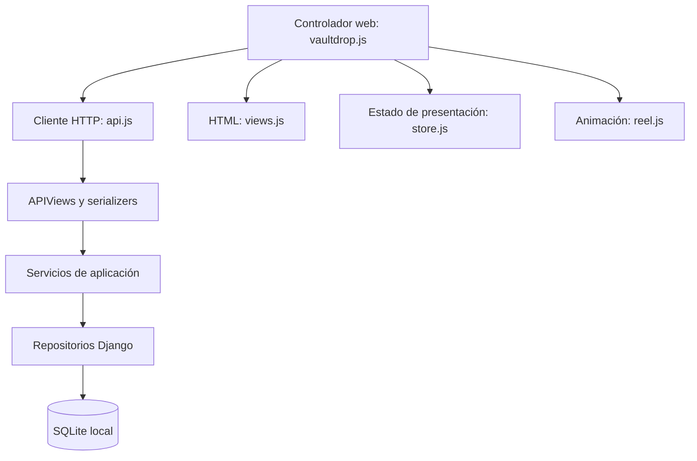

# Arquitectura actual de VaultDrop

## Alcance académico

Este documento describe código implementado, no una arquitectura futura. Se tomó como referencia la lista compartida del curso: Django, Factory, Builder, Django REST Framework, API Gateways, Docker y AWS. Los materiales privados de EAFIT y la rúbrica del Entregable 1 no estuvieron disponibles; no se afirma cumplimiento de criterios que no se pudieron leer.

VaultDrop es un **monolito modular con capa de servicios y repositorios**. Un proceso Django atiende web y API, y los módulos comparten una base de datos. No es un conjunto de microservicios ni una arquitectura hexagonal pura: los servicios usan transacciones Django y los repositorios devuelven modelos ORM. Esta dependencia explícita permite una implementación pequeña y comprobable.

## Responsabilidades

| Componente | Responsabilidad | No debe hacer |
|---|---|---|
| Vistas HTML / APIViews | Autenticación HTTP, validación de entrada, invocación del caso de uso, respuesta | Decidir premios o modificar saldos directamente |
| Servicios | Registro, apertura, créditos virtuales, venta y envío simulado | Construir HTML o interpretar respuestas del navegador |
| Repositorios | Consultas ORM, actualización condicional, persistencia | Elegir premios o enviar correos |
| Modelos | Estructura, relaciones y restricciones de datos | Depender del DOM |
| Serializers DRF | Contratos JSON y validación de entrada | Sustituir transacciones o garantizar compatibilidad automáticamente |
| Frontend | Mostrar respuestas, navegación y animación | Inventar premios, créditos o inventario |



### Módulos

- `users`: registro, acceso y perfil. `UserService` coordina construcción, guardado y billetera inicial.
- `wallet`: saldo y libro de transacciones. Solo `WalletService` cambia créditos.
- `cases`: catálogo, probabilidades e imágenes persistidas por objeto.
- `openings`: apertura e inventario, incluyendo venta y envío simulado.
- `core`: composición web, errores compartidos y ejecución idempotente. `account.py` es una composición de lectura para el cliente; serializa datos de varios módulos y no contiene reglas de mutación.

## Patrones del curso

### Builder

`UserBuilder` valida y construye un usuario sin guardarlo; aplica el hash de contraseña. `AperturaCajaBuilder` valida los datos de una apertura y devuelve los argumentos de persistencia. El servicio controla cuándo se guardan y dentro de qué transacción. En este tamaño de proyecto una función podría resolver parte del trabajo, pero los builders tienen una responsabilidad delimitada y permiten estudiar el patrón sin decidir transacciones.

### Factory

`NotificadorFactory` selecciona `NotificadorConsola` o `NotificadorEmail`, ambas con el contrato `INotificador`. El servicio puede recibir otro notificador en sus pruebas. La bienvenida se agenda con `transaction.on_commit(..., robust=True)`: solo se intenta después de guardar la cuenta y la billetera. No hay todavía una cola durable para reintentar correos fallidos.

### SOLID aplicado

- **Responsabilidad única:** APIViews adaptan HTTP; los servicios ejecutan casos de uso; la ruleta solo anima un resultado confirmado.
- **Abierto/cerrado:** una implementación alternativa del notificador puede incorporarse sin modificar el registro.
- **Sustitución:** las implementaciones de repositorio deben respetar sus contratos. Las pruebas sustituyen el azar para obtener resultados repetibles.
- **Interfaces pequeñas:** los contratos están separados por módulo y no se creó un repositorio universal.
- **Inversión de dependencias parcial:** servicios aceptan colaboradores por constructor. Sus valores por defecto siguen siendo implementaciones Django; no se afirma independencia total del framework.

## Consistencia y errores

Una apertura guarda débito, transacción, apertura e inventario en una transacción. Si falla una escritura, todo se revierte. El débito usa una actualización SQL condicionada a `saldo >= costo`, y una restricción impide saldos negativos. El saldo anterior del historial se deriva del saldo resultante dentro de la misma transacción.

Las operaciones HTTP de apertura, recarga, venta y envío aceptan `Idempotency-Key` (UUID). Una tabla guarda una clave única por usuario, la huella de la operación y su respuesta. Repetir clave y contenido devuelve el resultado previo. Reutilizar la clave con otro contenido devuelve 409. Si no se envía clave se crea una nueva, por compatibilidad: ese cliente no recibe protección frente a sus propios reintentos. El frontend sí envía y conserva la clave cuando hay un fallo de red o respuesta incierta.

Venta y envío usan `UPDATE ... WHERE estado = DISPONIBLE AND user = usuario_actual`. Solo una transición puede ganar. Un fallo al acreditar una venta revierte el cambio de estado. `ENVIADO` significa simulación persistida; no existe transferencia a Steam.

Los errores de aplicación tienen tipos y códigos estables; el adaptador HTTP los convierte a 400, 404 o 409. Una respuesta fallida jamás genera un premio de respaldo en JavaScript. La interfaz bloquea acciones mientras procesa una mutación. Los errores inesperados siguen siendo 500 para no ocultar defectos.

SQLite sigue siendo la base local. Una escritura puede esperar o fallar por contención bajo carga; la integridad no equivale a disponibilidad ilimitada. PostgreSQL sería una evolución a evaluar junto con pruebas concurrentes específicas de ese motor.

## Catálogo e imágenes

La base de datos es la fuente de `imagen_url`. La migración `cases.0003` carga asociaciones existentes desde una instantánea incluida con la migración. La API ya no necesita leer archivos del frontend para decidir imágenes. Los PNG siguen sirviéndose como recursos estáticos.

`python manage.py seed_catalog` crea solo cajas faltantes. No reemplaza precios ni asociaciones de cajas existentes. El catálogo inicial conserva los valores virtuales; Fracture usa el 25% de Nova del seed previo para que las probabilidades sumen 100% (el antiguo fallback JavaScript sumaba 99,5%). No son probabilidades oficiales de CS2.

## Verificación

```powershell
python manage.py check
python manage.py makemigrations --check --dry-run
python manage.py test apps --noinput
node --test tests/frontend.test.mjs
```

Se prueban registro, Builder, Factory, contratos DRF, saldo, idempotencia, aislamiento del inventario, rollback, perfil, catálogo y comportamiento del cliente ante errores. Las pruebas no sustituyen una evaluación de carga o un despliegue real.

## Límites pendientes

No se implementaron microservicios, una pasarela externa, integración Steam ni despliegue AWS. No hay paginación del resumen de cuenta ni política de limpieza de claves idempotentes; conviene definirlas cuando el volumen lo requiera. El resumen de cuenta agrega varias consultas y no promete una instantánea contable aislada frente a todas las operaciones concurrentes. Las dependencias exactas de la instalación probada están en `requirements.lock.txt`.

## Referencias técnicas

- Transacciones y callbacks: https://docs.djangoproject.com/en/6.1/topics/db/transactions/
- Actualizaciones ORM: https://docs.djangoproject.com/en/6.1/ref/models/querysets/
- Contratos y validación: https://www.django-rest-framework.org/api-guide/serializers/
