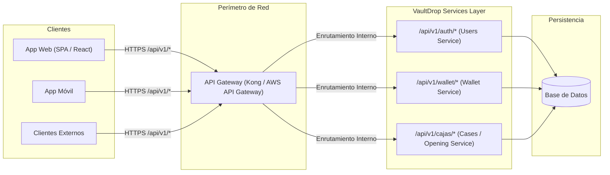

# Wiki: Preparación para API Gateway (Visión de Escalabilidad)

> **Entrega No. 1 — Arquitectura de Software 2026**  
> Proyecto: **VaultDrop**  
> Documento técnico sobre la estrategia de integración con un API Gateway y escalabilidad empresarial.

---

## 1. Introducción y Propósito del API Gateway

En una arquitectura de software empresarial de alto tráfico (como una plataforma de apertura de cajas en tiempo real), interconectar directamente a los clientes (web, apps móviles, bots o integraciones con terceros) con el servidor de aplicaciones monolítico genera cuellos de botella, riesgos de seguridad y acoplamiento.

Un **API Gateway** actúa como el punto único de entrada (*Single Entry Point*) que intercepta todas las peticiones entrantes, aplicando políticas perimetrales (seguridad, cuotas, enrutamiento y telemetría) antes de transferir el tráfico a los servicios internos de **VaultDrop**.

---

## 2. Características de VaultDrop que Habilitan un API Gateway

El diseño del backend de VaultDrop fue concebido específicamente para integrarse sin fricción con pasarelas como **Kong**, **AWS API Gateway**, **Apigee** o **NGINX / KrakenD**:

### A. Arquitectura Stateless (Sin Estado)
* **Tokens de Autenticación:** Las peticiones a la API utilizan `TokenAuthentication` mediante la cabecera estándar `Authorization: Token <key>`. 
* Al no depender de sesiones pegajosas (*sticky sessions*) en memoria de servidor para la API, cualquier nodo o réplica de VaultDrop puede responder cualquier petición, permitiendo escalabilidad horizontal inmediata (autoscaling en Kubernetes o ECS).

### B. Versionado Centralizado bajo `/api/v1/`
* Todas las rutas de negocio exponen prefijos homogéneos:
  * `/api/v1/auth/` (Registro, login, emisión de tokens)
  * `/api/v1/wallet/` (Consulta de saldos y movimientos)
  * `/api/v1/cajas/` (Catálogo de cajas y apertura)
* Esto permite que el API Gateway aplique reglas de reescritura, control de versiones semántico (`/v1/` vs `/v2/`) y deprecación gradual sin romper clientes existentes.

### C. Contratos Fuertes mediante DTOs (Serializers de DRF)
* Toda entrada y salida de datos está mediada por `Serializers`. 
* Esto blinda el esquema interno de la base de datos: si un modelo cambia de estructura interna, el contrato JSON acordado con el API Gateway permanece inmutable.

### D. Desacoplamiento Total vía Service Layer
* Dado que las `APIView` de Django Rest Framework no contienen reglas de negocio sino que delegan a `UserService`, `WalletService` o `AperturaCajaService`, el backend está preparado para una **transición natural hacia microservicios**.
* El Gateway puede redirigir `/api/v1/wallet/` a un microservicio contable dedicado en el futuro sin que el cliente web note la diferencia.

---

## 3. Responsabilidades Asumidas por el API Gateway

Al anteponer un API Gateway frente a VaultDrop, se descargan responsabilidades operativas críticas del servidor Django:

| Responsabilidad | Implementación en el Gateway | Beneficio para VaultDrop |
| :--- | :--- | :--- |
| **Rate Limiting & Throttling** | Límite de 30 peticiones/minuto en `/api/v1/cajas/{id}/abrir/` por IP o token. | Mitiga ataques de denegación de servicio (DoS) y scripts automatizados de apertura masiva. |
| **Edge Authentication** | Validación perimetral del token de usuario antes de enrutar la petición. | Las peticiones maliciosas o con tokens inválidos se rechazan en el borde de la red (Edge) sin consumir CPU ni memoria de Django. |
| **Terminación SSL / TLS** | Descarga de certificados SSL/HTTPS en el Gateway. | Django procesa tráfico HTTP interno seguro, optimizando recursos computacionales. |
| **CORS Centralizado** | Políticas de origen cruzado configuradas en el proxy. | Evita problemas de preflight `OPTIONS` dispersos en la configuración de la aplicación. |
| **Métricas y Telemetría** | Registro de latencia, códigos de error (4xx, 5xx) y throughput por endpoint. | Observabilidad integral del sistema sin sobrecargar la aplicación. |

---

## 4. Conclusión

La arquitectura implementada en VaultDrop cumple con los más altos estándares empresariales: es **completamente desacoplada**, **stateless**, **fácilmente enrutable** y está lista para ser consumida a través de una infraestructura de API Gateway distribuida.

