# Wiki: Diagrama de Secuencia de la Funcionalidad Más Compleja

> **Entrega No. 1 — Arquitectura de Software 2026**  
> Proyecto: **VaultDrop**  
> Funcionalidad: **Apertura de Caja y Otorgamiento de Recompensa** (`POST /api/v1/cajas/{id}/abrir/`)

---

## 1. Justificación de la Elección

La **Apertura de Caja** es el núcleo de negocio (*core domain*) más crítico y complejo de **VaultDrop**. Requiere coordinar múltiples dominios en una única unidad de trabajo consistente:
1. **Seguridad y Transporte:** Validación de autenticación por Token / Sesión en DRF.
2. **Economía Virtual:** Validación y débito atómico de saldo virtual en `apps.wallet`.
3. **Catálogo y Probabilidades:** Verificación de estado de la caja y validación matemática de que la suma de probabilidades sea exactamente 100%.
4. **Sorteo Estocástico:** Algoritmo ponderado de selección aleatoria criptográficamente segura.
5. **Patrón Creacional Builder:** Ensamble de la entidad `AperturaCaja` validando todas sus invariantes mediante `AperturaCajaBuilder`.
6. **Persistencia Dual:** Registro inmutable de la auditoría de tirada e inserción del nuevo ítem en el inventario del usuario.

---

## 2. Diagrama de Secuencia (Mermaid)

```mermaid
sequenceDiagram
    autonumber
    actor Cliente as Cliente HTTP (Frontend / Postman)
    participant V as AbrirCajaAPIView (DRF)
    participant S as AperturaCajaService
    participant RC as DjangoCajaRepository
    participant W as WalletService
    participant B as AperturaCajaBuilder
    participant RA as DjangoAperturaCajaRepository
    participant DB as Base de Datos (SQLite)

    Cliente->>V: POST /api/v1/cajas/{caja_id}/abrir/ [Header: Authorization Token]
    activate V
    
    V->>S: abrir(user, caja_id)
    activate S
    
    S->>RC: get_by_id(caja_id)
    RC-->>S: caja (o None -> CajaNoEncontradaError [404])
    
    alt Caja inactiva
        S-->>V: raise CajaNoDisponibleError [409]
    end

    S->>RC: list_items_for_caja(caja)
    RC-->>S: lista de CajaItem
    S->>S: _validar_items() -> Suma de probabilidades == 100%

    rect rgb(28, 33, 44)
        note over S,DB: Transacción Atómica (transaction.atomic)
        
        S->>W: tiene_saldo_suficiente(user, caja.precio)
        W-->>S: boolean (o False -> SaldoInsuficienteError [400])
        
        S->>S: _seleccionar_item() -> Ticket aleatorio ponderado (SystemRandom)
        
        S->>B: con_usuario(user).con_caja(caja).con_item(item).con_costo(precio).build()
        activate B
        B->>B: validar invariantes
        B-->>S: dict de datos validados
        deactivate B
        
        S->>W: debitar(user, caja.precio)
        W->>DB: UPDATE Billetera & INSERT Transaccion(tipo='DEBITO')
        
        S->>RA: create_apertura(**datos)
        RA->>DB: INSERT INTO AperturaCaja
        
        S->>RA: create_inventario_item(user, item, apertura)
        RA->>DB: INSERT INTO ItemInventario
    end

    S-->>V: apertura, inventario_item
    deactivate S

    V->>V: AperturaCajaSerializer(apertura)
    V-->>Cliente: HTTP 201 Created { id, caja, item, costo, created_at }
    deactivate V
```

---

## 3. Detalle Paso a Paso de la Ejecución

1. **Recepción de la Petición:** El cliente envía la petición autenticada. La vista `AbrirCajaAPIView` verifica permisos (`IsAuthenticated`) y delega de inmediato el caso de uso a `AperturaCajaService.abrir()`.
2. **Validaciones Previas al Bloque Transaccional:**
   * Se recupera la caja del repositorio. Si no existe, se lanza `CajaNoEncontradaError`, traducida automáticamente a código **HTTP 404 Not Found**.
   * Se comprueba si la caja está activa. Si está deshabilitada, se lanza `CajaNoDisponibleError`, traducida a **HTTP 409 Conflict**.
   * Se verifica que la caja contenga ítems y que la suma de sus probabilidades sea exactamente `100.00%`.
3. **Bloque Transaccional Atómico (`transaction.atomic()`):**
   * Se consulta a `WalletService` si el usuario cuenta con fondos suficientes. Si no, se interrumpe con `SaldoInsuficienteError` (**HTTP 400 Bad Request**).
   * Se realiza el sorteo aleatorio acumulando probabilidades con `random.SystemRandom`.
   * Se construye la instancia mediante el patrón **Builder** (`AperturaCajaBuilder`), garantizando que no se persista ningún objeto con datos incompletos o inconsistentes.
   * Se debita el costo de la caja de la billetera del usuario, generando la transacción contable correspondiente.
   * Se crea el registro inmutable de `AperturaCaja` y el ítem resultante se inserta en la tabla `ItemInventario` del usuario.
   * *Garantía ACID:* Si cualquier paso falla dentro de este bloque, la base de datos revierte automáticamente todos los cambios, asegurando que jamás se cobre dinero sin otorgar el ítem.
4. **Respuesta:** La vista serializa la entidad persistida con `AperturaCajaSerializer` y retorna un código **HTTP 201 Created** con el detalle completo del premio obtenido.

