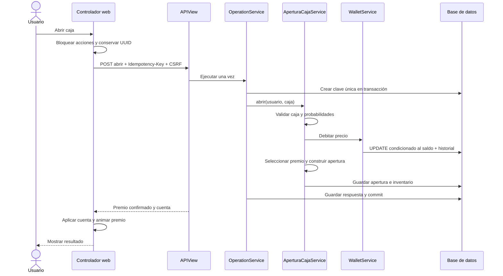

# Secuencia real: abrir una caja

Un fallo anterior al commit revierte la operación. Un reintento con la misma clave recupera la respuesta guardada. El navegador no descuenta créditos ni elige premios por su cuenta; el azar del archivo `reel.js` solo llena tarjetas decorativas de la animación.
