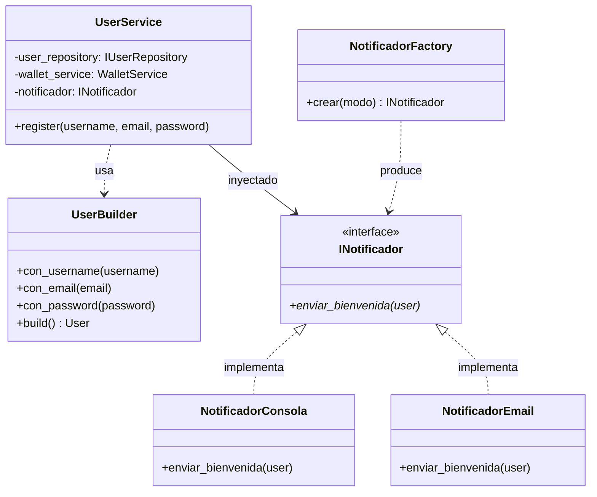

# Wiki: Implementación de Patrones Creacionales (Builder y Factory)

> **Entrega No. 1 — Arquitectura de Software 2026**  
> Proyecto: **VaultDrop**  
> Documento técnico explicativo y justificación de los patrones creacionales implementados.

---

## 1. Patrón Creacional: Builder (Constructor)

El patrón **Builder** se utiliza para construir objetos complejos paso a paso, separando la construcción de un objeto complejo de su representación final y de su persistencia en base de datos.

En VaultDrop se implementó el patrón Builder en dos componentes esenciales:

### A. `UserBuilder` (`apps/users/domain/builders.py`)
* **Problema que resuelve:** La creación de usuarios requería múltiples validaciones previas (campos requeridos, formato y longitud mínima de contraseña de 8 caracteres). Dispersar estas reglas en formularios o vistas violaba SRP y dificultaba reutilizar la creación de usuarios en otros contextos (tests, comandos o seeds).
* **Solución:** `UserBuilder` ofrece una interfaz fluida (*Fluent Interface*) para configurar el objeto paso a paso (`.con_username().con_email().con_password().build()`). El método `build()` valida exhaustivamente las invariantes del dominio **antes** de retornar el objeto listo para persistir, sin llamar a `.save()`. Es `UserService` quien decide persistirlo dentro de la transacción atómica junto a la billetera inicial.

```python
# Ejemplo de uso en UserService
user = (
    UserBuilder(self.user_model)
    .con_username(username)
    .con_email(email)
    .con_password(password)
    .build()
)
user.save()
```

---

### B. `AperturaCajaBuilder` (`apps/openings/domain/builders.py`)
* **Problema que resuelve:** La apertura de una caja (`AperturaCaja`) es la entidad más compleja del sistema. Vincula al usuario que abre, la caja seleccionada, el ítem obtenido del sorteo estocástico, el costo debitado y la fecha de la tirada. Construir este objeto con un constructor tradicional lleno de parámetros (*Telescoping Constructor*) generaba código rígido y propenso a errores de asignación.
* **Solución:** `AperturaCajaBuilder` garantiza que ningún registro de apertura se cree con datos incompletos o inválidos:

```python
# apps/openings/domain/builders.py
class AperturaCajaBuilder:
    def __init__(self):
        self._user = None
        self._caja = None
        self._item = None
        self._costo = None

    def con_usuario(self, user):
        self._user = user
        return self

    def con_caja(self, caja):
        self._caja = caja
        return self

    def con_item(self, item):
        self._item = item
        return self

    def con_costo(self, costo):
        self._costo = costo
        return self

    def build(self):
        if not self._user or not self._caja or not self._item or self._costo is None:
            raise ValueError('Datos incompletos para registrar la apertura de caja.')
        return {
            'user': self._user,
            'caja': self._caja,
            'item': self._item,
            'costo': self._costo,
        }
```

---

## 2. Patrón Creacional: Factory (Fábrica)

El patrón **Factory** se utiliza para instanciar objetos pertenecientes a una misma familia jerárquica sin acoplar la capa de aplicación a las clases concretas.

### `NotificadorFactory` (`apps/users/infra/factories.py`)
* **Problema que resuelve:** Al registrarse un usuario, el sistema debe enviarle un mensaje de bienvenida. Sin embargo, en entornos de desarrollo y pruebas automatizadas no es deseable depender de un servidor SMTP real o de servicios externos de terceros (como SendGrid o AWS SES).
* **Solución:** Se definió la interfaz abstracta `INotificador` con dos implementaciones concretas:
  1. `NotificadorConsola` (**Modo MOCK**): Imprime el mensaje en logs y consola. Ideal para tests y desarrollo local sin dependencias.
  2. `NotificadorEmail` (**Modo REAL**): Envía un correo electrónico formal usando `django.core.mail.send_mail`.

`NotificadorFactory` centraliza la decisión de cuál instanciar basándose en la variable de entorno `NOTIFICACION_MODE`:

```python
# apps/users/infra/factories.py
class NotificadorFactory:
    @staticmethod
    def crear(modo=None):
        modo = (modo or os.environ.get('NOTIFICACION_MODE', 'MOCK')).upper()
        if modo == 'REAL':
            return NotificadorEmail()
        return NotificadorConsola()
```

`UserService` recibe el notificador inyectado por constructor. De este modo, la capa de servicio cumple el **Principio Abierto/Cerrado (OCP)** y el **Principio de Inversión de Dependencias (DIP)**: depende de la abstracción `INotificador`, pudiendo añadir en el futuro notificaciones por SMS o Discord sin modificar una sola línea del servicio.

---

## 3. Diagrama de Relación de Patrones



---

## 4. Conclusión

Ambos patrones resuelven problemas concretos de diseño arquitectónico:
* **Builder** asegura integridad y consistencia en la creación de los dos objetos con mayor carga de reglas de dominio (`User` y `AperturaCaja`).
* **Factory** aísla la infraestructura externa de notificaciones, permitiendo ejecución de pruebas instantáneas sin dependencias de red.

