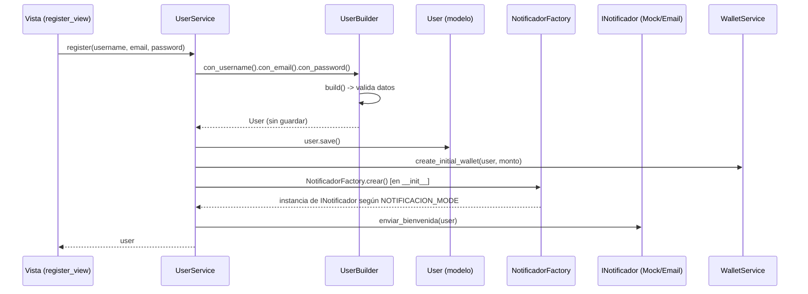

# Implementación del Patrón Creacional

> Contenido listo para copiar tal cual a la página de la Wiki de GitHub
> titulada **"Implementación del Patrón Creacional"**.

## Módulo: Registro de Usuario

### Problema

El flujo de registro de usuario (`apps/users/views.py`) mezclaba, todo dentro
de la vista, responsabilidades que no le correspondían:

- Lectura y validación de datos del formulario.
- Reglas de negocio: verificación de contraseña mínima, verificación de email
  duplicado.
- Construcción directa del `User` con `create_user(...)`, sin ningún paso de
  validación intermedio ni forma de reutilizar esa construcción en otro
  contexto (ej. un comando de management, una API, un seed de datos de
  prueba).
- Creación de la billetera inicial acoplada a la misma función.
- Ningún mecanismo para notificar la bienvenida al usuario, y de haberlo
  agregado ahí mismo, hubiera acoplado la vista a un proveedor de correo
  concreto.

En resumen: la vista concentraba capa de interfaz, lógica de negocio y
creación de objetos complejos en un solo lugar, violando el Principio de
Responsabilidad Única (S de SOLID) y dificultando las pruebas unitarias.

### Solución Arquitectónica

Se separó el flujo en tres capas:

- **`UserService`** (`apps/users/services.py`) — Capa de Aplicación (Service
  Layer). Orquesta el caso de uso "registrar usuario": valida que el email no
  esté duplicado, delega la construcción del `User` al `UserBuilder`, delega
  la creación de la billetera inicial a `WalletService`, y delega el envío
  de la notificación de bienvenida al `notificador` que recibe inyectado en
  el constructor (Inyección de Dependencias). Todo ocurre dentro de una
  transacción atómica (`transaction.atomic()`), garantizando consistencia.

- **`UserBuilder`** (`apps/users/domain/builders.py`) — Patrón **Builder**.
  Construye el `User` paso a paso mediante una interfaz fluida
  (`.con_username(...).con_email(...).con_password(...).build()`). El método
  `build()` valida los datos acumulados (campos obligatorios, longitud mínima
  de contraseña) **antes** de devolver el objeto, y lanza `ValueError` si algo
  es inválido. El `User` que retorna está listo para persistir pero **no se
  guarda dentro del Builder**: es `UserService` quien decide cuándo llamar a
  `.save()`, dentro de la transacción, junto a la creación de la billetera.
  Esto mantiene al Builder enfocado únicamente en garantizar la validez del
  objeto, sin mezclar responsabilidades de persistencia.

- **`NotificadorFactory`** (`apps/users/infra/factories.py`) — Patrón
  **Factory**. Decide, según la variable de entorno `NOTIFICACION_MODE`, qué
  implementación de `INotificador` instanciar:
  - `MOCK` (valor por defecto): `NotificadorConsola`, que solo imprime/loguea
    el mensaje de bienvenida. Útil en desarrollo y en tests, sin depender de
    ningún servicio externo.
  - `REAL`: `NotificadorEmail`, que envía un correo real mediante
    `django.core.mail.send_mail`.

  `UserService` no conoce ni instancia directamente ninguna de las dos
  implementaciones: recibe el `notificador` ya resuelto por la Factory
  (inyectado por constructor), lo que permite cambiar de comportamiento sin
  tocar el servicio (Principio Abierto/Cerrado).

### Diagrama de Flujo



### Snippet Clave

```python
# apps/users/services.py
class UserService:
    def __init__(self, user_repository=None, wallet_service=None, notificador=None):
        self.user_model = get_user_model()
        self.user_repository = user_repository or None
        self.wallet_service = wallet_service or WalletService()
        self.notificador = notificador or NotificadorFactory.crear()

    def register(self, username, email, password, initial_credit=Decimal('1000.00')):
        if self.user_model.objects.filter(email=email).exists():
            raise ValueError('El correo ya está registrado')

        with transaction.atomic():
            user = (
                UserBuilder(self.user_model)
                .con_username(username)
                .con_email(email)
                .con_password(password)
                .build()
            )
            user.save()
            self.wallet_service.create_initial_wallet(user, initial_credit)
            self.notificador.enviar_bienvenida(user)
        return user
```

### Justificación de las Decisiones de Diseño

- **Builder** se eligió porque `User` es un objeto cuya construcción tiene
  varios pasos y reglas de validez (username, email y password obligatorios,
  password con longitud mínima) que antes vivían dispersas entre el
  `RegistrationForm` y la vista. Centralizarlas en un Builder con interfaz
  fluida hace explícito el orden de construcción, permite reutilizar la
  lógica de validación en otros contextos (comandos, fixtures, tests) y
  garantiza que nunca se llegue a `.save()` con un objeto inválido.

- **Factory** se eligió porque el mecanismo de notificación de bienvenida es
  una dependencia externa (potencialmente un proveedor de email real) que
  debe poder cambiar de comportamiento entre entornos (desarrollo/tests vs.
  producción) sin modificar el código del servicio. La Factory encapsula esa
  decisión en un solo punto (`NOTIFICACION_MODE`), y `UserService` solo
  depende de la abstracción `INotificador`, cumpliendo el Principio de
  Inversión de Dependencias (D de SOLID).

- Ambos patrones, en conjunto, permiten que la vista (`register_view`) se
  reduzca a menos de 15 líneas: solo captura los datos del `request`, llama a
  `UserService().register(...)` y maneja la respuesta HTTP.
